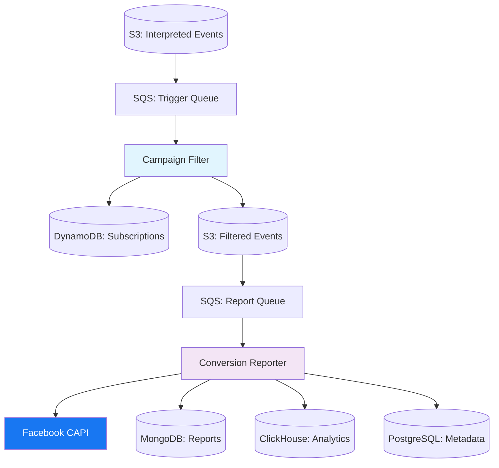

# 🚀 Production Grade Efflux Conversion Reporting Solution

[](https://buymeacoffee.com/gier)

A high-performance, cloud-native conversion reporting system that seamlessly integrates with Facebook's Conversion API (CAPI) to deliver real-time advertising conversion tracking at scale. Built with scalability and the ability to handle large amounts of conversions - hence the name Efflux.

## 📋 Table of Contents

- [Overview](#overview)
- [Architecture](#architecture)
- [Key Features](#key-features)
- [Core Modules](#core-modules)
- [Technology Stack](#technology-stack)
- [Installation](#installation)
- [Configuration](#configuration)
- [Usage](#usage)
- [API Reference](#api-reference)
- [Monitoring & Logging](#monitoring--logging)
- [Deployment](#deployment)
- [Development](#development)
- [Contributing](#contributing)
- [Support](#support)

## 🔍 Overview

The Efflux Conversion Reporting Solution is an enterprise-grade system designed to process high-volume conversion data from multiple traffic sources and report them to advertising platforms like Facebook through their Conversion API. Built on AWS infrastructure, it provides reliable, scalable, and efficient conversion tracking with comprehensive monitoring and error handling.

### What it does:
- 📊 Processes conversion events from multiple traffic sources (Tonic, Crossroads, etc.)
- 🎯 Filters campaigns based on subscription preferences
- ✅ Validates conversion data for quality and compliance
- 📤 Reports valid conversions to Facebook CAPI in real-time
- 💾 Stores all conversion data for analytics and auditing
- 🔄 Provides automatic retry mechanisms and error handling
- 📈 Offers comprehensive monitoring and metrics collection

## 🏗️ Architecture



### Data Flow:
1. **Event Ingestion**: S3 receives conversion data from traffic sources
2. **Campaign Filtering**: Filters events based on DynamoDB subscription data
3. **Conversion Processing**: Validates, transforms, and processes conversion events
4. **Facebook Reporting**: Sends valid conversions to Facebook CAPI
5. **Data Storage**: Persists all data to MongoDB and ClickHouse for tracking and analytics

## ✨ Key Features

### 🎯 **Smart Campaign Filtering**
- Dynamic campaign subscription management via DynamoDB
- Configurable filtering rules with bypass options
- Real-time filtering metrics and monitoring

### 🔒 **Robust Validation System**
- Facebook pixel validation against authorized pixel IDs
- 7-day conversion window enforcement
- Traffic source click ID verification
- Comprehensive error categorization

### 📊 **Multi-Platform Reporting**
- Facebook Conversion API integration with batching
- TikTok integration ready (framework in place)
- Automatic retry mechanisms for failed reports
- Support for multiple event types and custom data

### 🚀 **High Performance & Scalability**
- AWS Auto Scaling Group with EC2 instances
- SQS-based queue processing with dead letter queues
- Efficient batching algorithms (up to 1000 events per batch)
- ClickHouse optimization scheduling every 3 hours

### 📈 **Advanced Monitoring**
- CloudWatch integration for metrics and logging
- Real-time processing statistics
- Custom metrics for conversion rates and filtering ratios
- Comprehensive error tracking and alerting

### 🔄 **Data Consistency**
- Duplicate detection using session ID and keyword combinations
- MongoDB-based deduplication with timestamp range queries
- Atomic operations for data integrity
- Audit trail for all conversion events

## 🧩 Core Modules

### 🎛️ **ConversionReporter**
*Location: `src/modules/conversionReporter/`*

The main processing engine that handles conversion data lifecycle:
- Processes SQS messages containing S3 event notifications
- Validates conversion events against business rules
- Reports valid conversions to Facebook CAPI
- Manages data persistence across multiple databases
- Implements comprehensive error handling and retry logic

**Key Methods:**
- `processQueueMessage()` - Main message processing pipeline
- `filterConversions()` - Deduplication and filtering logic
- `reportToFacebook()` - Facebook CAPI integration
- `labelBrokenEvents()` - Validation and error categorization

### 🔍 **CampaignFilter**
*Location: `src/modules/campaignFilter/`*

Intelligent filtering system for campaign-based processing:
- Reads subscription data from DynamoDB
- Filters conversion events based on campaign subscriptions
- Supports bypass mode for testing and development
- Provides detailed filtering metrics and reporting

**Key Features:**
- Dynamic subscription management
- Configurable filtering rules
- Performance metrics tracking
- S3 integration for filtered data storage

### ⚡ **ClickHouseOptimizer**
*Location: `src/modules/optimization/`*

Database optimization module for maintaining peak performance:
- Automated table optimization scheduling
- OPTIMIZE TABLE command execution
- Performance monitoring and logging
- Configurable optimization intervals

### 🔗 **FacebookService**
*Location: `src/modules/conversionReporter/services/`*

Comprehensive Facebook CAPI integration:
- Multi-pixel support with dynamic token management
- Intelligent event batching algorithms
- Custom event payload construction
- Network-specific event mapping (Tonic vs Crossroads)
- User data transformation and hashing

**Supported Event Types:**
- Page View events
- View Content events
- Custom conversion events with dynamic parameters

## 🛠️ Technology Stack

### **Backend Technologies**
-  **Node.js 20+** - Runtime environment
-  **Express.js** - Web application framework
-  **ES6+** - Programming language

### **Database & Storage**
-  **MongoDB** - Primary data storage for conversion reports
-  **ClickHouse** - Analytics and high-performance queries
-  **PostgreSQL** - Metadata and configuration storage
-  **DynamoDB** - Campaign subscription management

### **AWS Infrastructure**
-  **S3** - Event data storage and processing triggers
-  **SQS** - Message queue processing with DLQ support
-  **EC2** - Auto Scaling Groups for high availability
-  **CodeDeploy** - Automated deployment pipeline
-  **CloudWatch** - Monitoring, logging, and alerting

### **External Integrations**
-  **Facebook Conversion API** - Primary advertising platform integration
- **TikTok API** - Future integration (framework ready)

### **DevOps & Tools**
-  **PM2** - Process management and clustering
-  **Winston** - Advanced logging with CloudWatch integration
-  **Node-Cron** - Scheduled task management

## 🚀 Installation

### Prerequisites
- Node.js 20+ and npm
- AWS CLI configured with appropriate permissions
- Access to required AWS services (S3, SQS, DynamoDB, etc.)
- Database connections (MongoDB, ClickHouse, PostgreSQL)

### Quick Start

1. **Clone the repository**
   ```bash
   git clone <repository-url>
   cd efflux-conversions-reporting-solution
   ```

2. **Install dependencies**
   ```bash
   npm install
   ```

3. **Environment setup**
   ```bash
   cp .env.example .env
   # Configure your environment variables
   ```

4. **Database setup**
   ```bash
   # Run ClickHouse migrations
   # Set up MongoDB collections
   # Configure PostgreSQL tables
   ```

5. **Start the application**
   ```bash
   npm start
   # or for development
   npm run dev
   ```

## ⚙️ Configuration

### Environment Variables

#### **Core Application Settings**
```env
PORT=5000
NODE_ENV=production
ENVIRONMENT_LOCATION=aws  # or "local" for development
```

#### **AWS Services**
```env
TRIGGER_CONVERSION_REPORTS_QUEUE_URL=<sqs-trigger-queue-url>
REPORT_CONVERSIONS_QUEUE_URL=<sqs-report-queue-url>
```

#### **Database Connections**
```env
MONGODB_URI_TEST=<mongodb-connection-string>
MONGODB_DATABASE=<database-name>
CLICKHOUSE_URL=<clickhouse-connection-string>
DATABASE_URL=<postgresql-connection-string>
```

#### **Logging & Monitoring**
```env
LOGGING_ENVIRONMENT=production
LOG_LEVEL=info
```

#### **Feature Toggles**
```env
DISABLE_POLLING_FOR_CONVERSION_REPORTS_TRIGGER=false
DISABLE_POLLING_FOR_CONVERSION_REPORTING=false
DISABLE_SUBSCRIPTION_FILTERING=false
```

## 📖 Usage

### Starting the Service

The application automatically initializes two main processing pipelines:

1. **Campaign Filtering Pipeline**: Monitors the trigger queue for new conversion data
2. **Conversion Reporting Pipeline**: Processes filtered conversions and reports to Facebook

```bash
npm start
```

### Processing Flow

1. **Upload test data** (for development):
   ```bash
   node uploadJsonToS3.js path/to/your/conversion-data.json
   ```

2. **Monitor logs**:
   - Check CloudWatch logs for production
   - Local console output for development

3. **Track metrics**:
   - Conversion processing rates
   - Facebook API response rates
   - Error rates and categorization

### Testing

#### **MongoDB Testing**
```bash
# Test single conversion
node tests/testMongoDb.js single_conversion

# Test batch processing
node tests/testMongoDb.js batch_processing
```

#### **Production Pipeline Testing**
```bash
# Test with mock SQS message
node tests/testProductionPipeline.js mock_sqs_message

# Test with multiple conversions
node tests/testProductionPipeline.js mock_sqs_message_with_multiple_conversions
```

## 📊 API Reference

### Health Check Endpoint
```http
GET /
```
Returns: `"The world is yours!"` - Confirms service is running

### Processing Metrics
The system automatically reports the following metrics to CloudWatch:
- `TotalRecordsProcessed` - Number of conversion records processed
- `TotalRecordsFiltered` - Number of records that passed filtering
- `FilteringRatio` - Percentage of records that passed filtering
- `ProcessedMessages` - Number of SQS messages processed successfully
- `FailedMessages` - Number of SQS messages that failed processing

## 📈 Monitoring & Logging

### CloudWatch Integration
- **Log Groups**: `/aws/ec2/conversion-reporting`
- **Log Streams**: Separate streams for each component
  - `server` - Application server logs
  - `conversion-reporter` - Main processing logs
  - `trigger-conversion-reports-queue` - Filtering pipeline logs
  - `report-conversions-queue` - Reporting pipeline logs
  - `optimization` - Database optimization logs

### Key Metrics to Monitor
- **Processing Rate**: Conversions processed per minute
- **Facebook API Success Rate**: Percentage of successful CAPI calls
- **Queue Depth**: SQS message backlog
- **Error Rate**: Failed processing attempts
- **Database Performance**: Query execution times

### Alerting
- SNS notifications for deployment events
- Auto Scaling notifications for capacity changes
- Dead Letter Queue monitoring for failed messages

## 🚀 Deployment

### AWS Infrastructure
The system uses CloudFormation for infrastructure as code:

```bash
cd infrastructure
make deploy STACK_NAME=conversion-reporting ENVIRONMENT=production
```

### CodeDeploy Pipeline
Automated deployment using AWS CodeDeploy:
1. Code changes trigger deployment
2. Rolling deployment to EC2 instances
3. Health checks ensure service availability
4. Rollback capability for failed deployments

### Deployment Scripts
- `deployment_scripts/before_install.sh` - Pre-deployment setup
- `deployment_scripts/after_install.sh` - Post-deployment configuration
- `deployment_scripts/application_start.sh` - Service startup
- `deployment_scripts/application_stop.sh` - Graceful shutdown

## 👨‍💻 Development

### Local Development Setup

1. **Install PM2 globally**:
   ```bash
   npm install -g pm2
   ```

2. **Start with PM2 (recommended)**:
   ```bash
   pm2 start ecosystem.config.js --env development
   ```

3. **Development with auto-reload**:
   ```bash
   pm2 start ecosystem.config.js --env development --watch
   ```

### Code Structure
```
src/
├── modules/           # Core business logic modules
│   ├── campaignFilter/    # Campaign filtering logic
│   ├── conversionReporter/ # Main conversion processing
│   └── optimization/      # Database optimization
├── shared/            # Shared utilities and services
│   ├── lib/              # Database connections and services
│   ├── services/         # Common application services
│   └── utils/            # Utility functions and helpers
tests/                 # Test files and sample data
infrastructure/        # AWS CloudFormation templates
deployment_scripts/    # Deployment automation scripts
```

### Best Practices
- Use environment variables for all configuration
- Implement comprehensive error handling
- Add monitoring and metrics to all new features
- Follow the existing logging patterns
- Write tests for critical business logic

## 🤝 Contributing

1. Fork the repository
2. Create a feature branch (`git checkout -b feature/amazing-feature`)
3. Commit your changes (`git commit -m 'Add amazing feature'`)
4. Push to the branch (`git push origin feature/amazing-feature`)
5. Open a Pull Request

### Development Guidelines
- Follow existing code style and patterns
- Add appropriate logging and monitoring
- Update documentation for new features
- Include tests for new functionality
- Ensure AWS resource cleanup in development

## 💡 Support

### Getting Help
- 📖 Check the documentation and code comments
- 🐛 Report issues through GitHub Issues
- 💬 Join discussions in GitHub Discussions

### Support the Project
If this project has been helpful to you, consider supporting its development:

[](https://buymeacoffee.com/gier)

### Professional Services
For enterprise support, custom implementations, or consulting services, please reach out through the support channels above.

